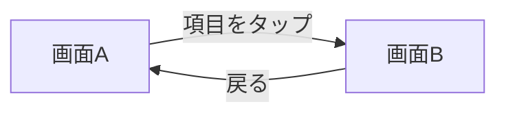

# 画面構成と遷移

ワイヤーフレーム実体は [wireframes/](wireframes/)（ブラウザで開く / HTML + Tailwind）。
ここでは画面の役割と遷移を文章で残す。要素の振る舞いは spec（例: `../1_spec/`）が正。

## 画面一覧

| 画面 | 役割 | 仕様 |
| --- | --- | --- |
| 画面A | アプリの入口・一覧 | [xxxx.md](../1_spec/xxxx.md) |
| 画面B | 主要操作 | [yyyy.md](../1_spec/yyyy.md) |

## 遷移

- 画面A で項目をタップ → 画面B を開く。
- 画面B から戻る → 画面A へ。

## 状態バリエーション（ワイヤーに含む）

- 画面A: 通常 / 空（初回） / 読み込み失敗 / データ欠損時のフォールバック。
- 画面B: 読込中 / 完了 / 操作不可（権限・前提なし）。

## 未確定（このワイヤーで決めていないこと）

- 配色・タイポグラフィ・アイコンの最終形（低忠実度のまま）。
- 〔ここに、意図的に保留している判断を列挙する〕。
