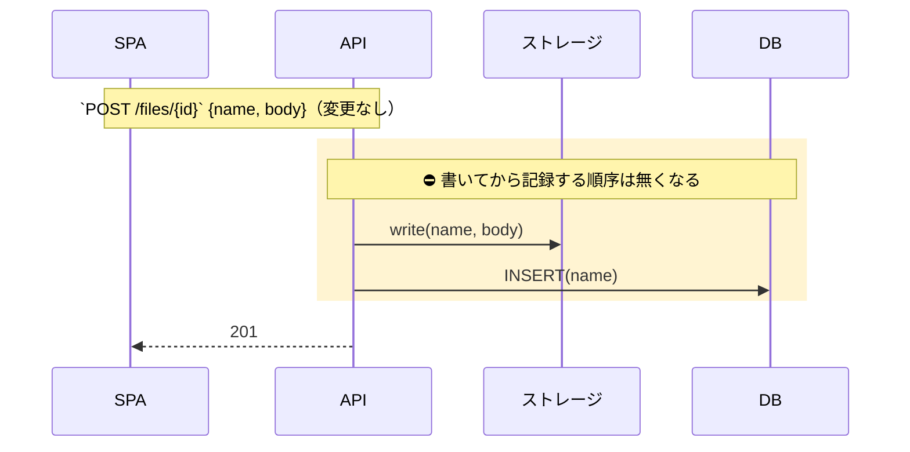
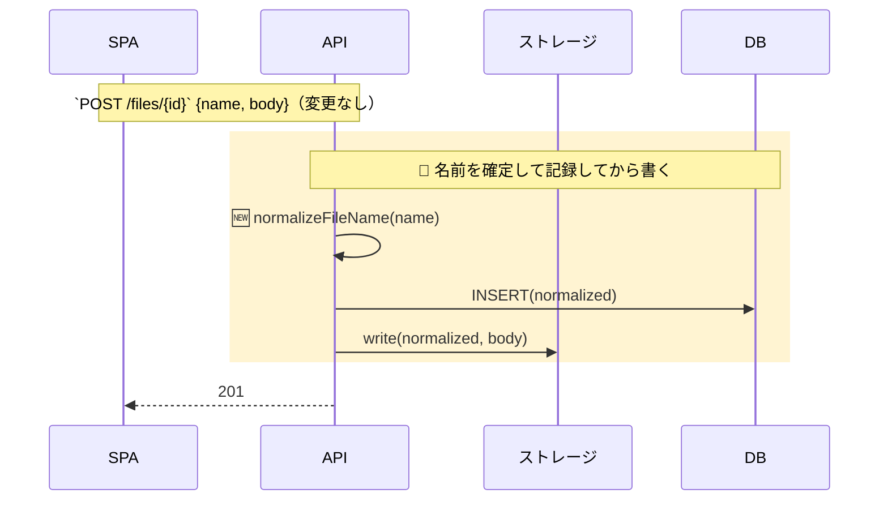
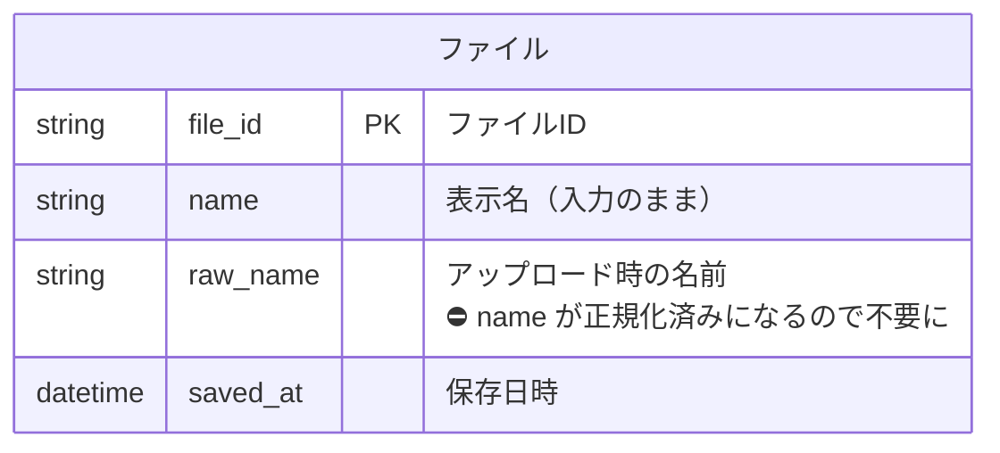
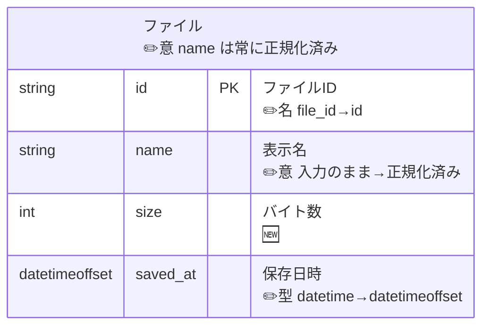
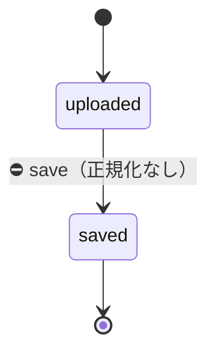
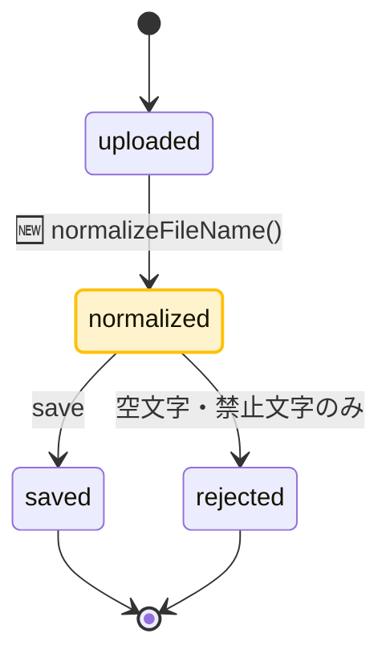
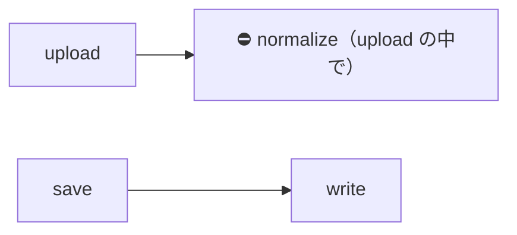
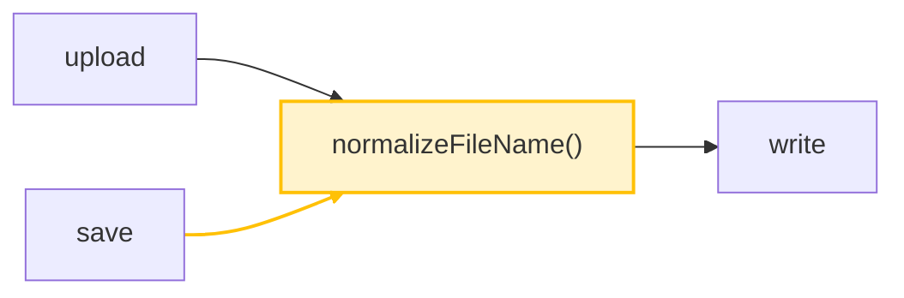

# 図の見本 — 種類ごとの Before / After と印の付け方

題材は [templates/report.md](../templates/report.md) と同じ「ファイル名の正規化を保存時にも適用する」PR。各図は**変わった区間だけ**で、変わらない前後は Note 1 行に畳んでいる。

凡例: 背景色＝順序や構造が変わった区間（先頭の Note に 🆕 新規区間／🔀 組み替え／⛔ 消える区間）、🆕＝追加、✏️＝変更（After 側）、⛔＝削除（Before 側）。ER 図の列は元の説明の下に ✏️名・✏️型・✏️意（名前・型・意味のどれが変わったか）と旧→新を書く。

## シーケンス図（`rect` で区間を塗り、先頭の Note をキャプションにする）

示していること: 順序の組み替えは 🔀、Before 側の消える区間は ⛔、区間の中で新しい行だけ 🆕、参加しない participant（ユーザー）は消す。

**Before**

**After**

## ER 図（印は説明セルだけ。元の説明の後に ` ` で改行して印を書く）

示していること: 列の改名 ✏️名、型の変更 ✏️型、意味の変更 ✏️意、新規列 🆕、消える列は Before 側に ⛔ と理由。エンティティの改名は角括弧のラベルに同じ書き方。型・名前のセルには mermaid の制約で ASCII 識別子しか置けない。

**Before**

**After**

## 状態遷移図（`classDef` で新しい状態を塗る。塗ったノードから出る辺には印を付けない）

示していること: 新しい状態はノードを塗る、そこへ入る遷移に 🆕、Before 側の消える遷移に ⛔。

**Before**

**After**

## flowchart（ノードは `classDef`、辺は `linkStyle`）

示していること: 呼び出し関係の変化。共通化されたノードを塗り、新しい辺を `linkStyle` で塗る（辺の番号は 0 始まりの出現順）。

**Before**

**After**

